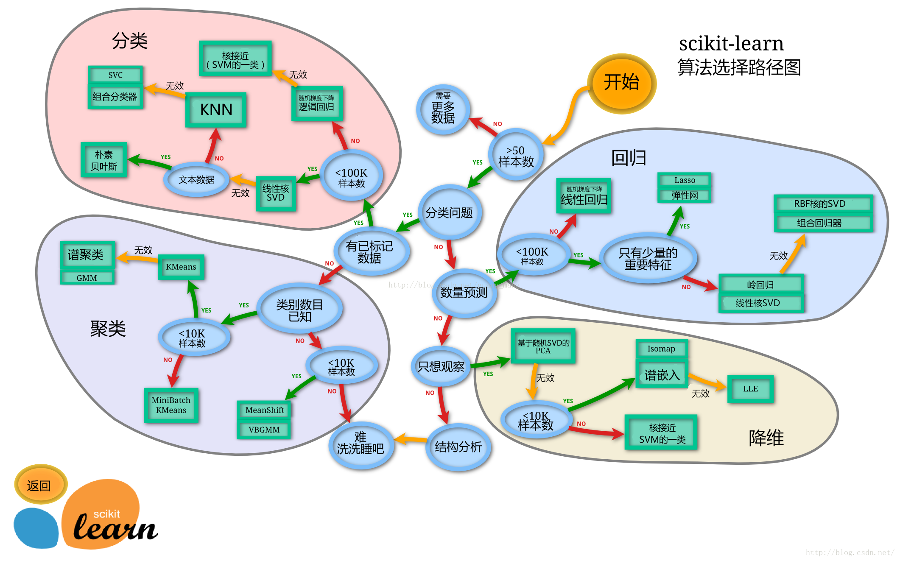
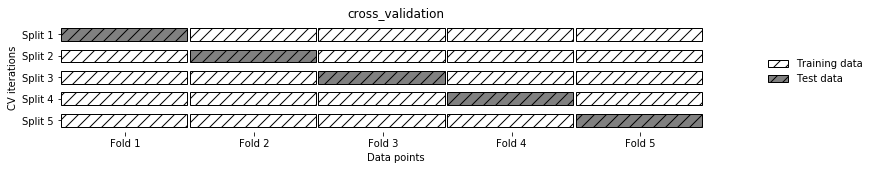
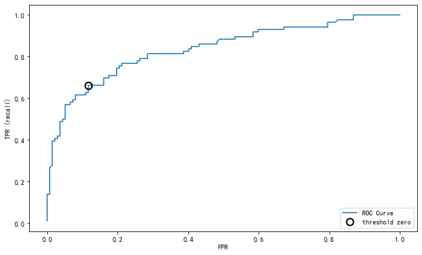

## 3 第三章 模型搭建

经过前面的探索性数据分析我们可以很清楚的了解到数据集的情况，以及得出了一些结论。

下面我们将搭建一个预测模型，运用机器学习的方式来为泰坦尼克船只做一个预测，我们在测试集的数据中来预测哪些乘客将会存活，哪些乘客将遭遇不幸。然后我们会对我们的模型做一个评价。

这一章的内容可以学习到数据建模以及模型评价的知识，算是进阶的内容，为之后的数据分析课程打下基础。


```python
import pandas as pd
import numpy as np
import seaborn as sns
import matplotlib.pyplot as plt
from IPython.display import Image
```

了解上面的库的作用


```python
%matplotlib inline
```


```python
plt.rcParams['font.sans-serif'] = ['SimHei']  # 用来正常显示中文标签
plt.rcParams['axes.unicode_minus'] = False  # 用来正常显示负号
plt.rcParams['figure.figsize'] = (10, 6)  # 设置输出图片大小
```


```python
# 读取训练数集
train = pd.read_csv('train.csv')
train.shape
```


    (891, 12)


```python
train.head()
```


<div>
<style scoped>
    .dataframe tbody tr th:only-of-type {
        vertical-align: middle;
    }

    .dataframe tbody tr th {
        vertical-align: top;
    }

    .dataframe thead th {
        text-align: right;
    }
</style>
<table border="1" class="dataframe">
  <thead>
    <tr style="text-align: right;">
      <th></th>
      <th>PassengerId</th>
      <th>Survived</th>
      <th>Pclass</th>
      <th>Name</th>
      <th>Sex</th>
      <th>Age</th>
      <th>SibSp</th>
      <th>Parch</th>
      <th>Ticket</th>
      <th>Fare</th>
      <th>Cabin</th>
      <th>Embarked</th>
    </tr>
  </thead>
  <tbody>
    <tr>
      <th>0</th>
      <td>1</td>
      <td>0</td>
      <td>3</td>
      <td>Braund, Mr. Owen Harris</td>
      <td>male</td>
      <td>22.0</td>
      <td>1</td>
      <td>0</td>
      <td>A/5 21171</td>
      <td>7.2500</td>
      <td>NaN</td>
      <td>S</td>
    </tr>
    <tr>
      <th>1</th>
      <td>2</td>
      <td>1</td>
      <td>1</td>
      <td>Cumings, Mrs. John Bradley (Florence Briggs Th...</td>
      <td>female</td>
      <td>38.0</td>
      <td>1</td>
      <td>0</td>
      <td>PC 17599</td>
      <td>71.2833</td>
      <td>C85</td>
      <td>C</td>
    </tr>
    <tr>
      <th>2</th>
      <td>3</td>
      <td>1</td>
      <td>3</td>
      <td>Heikkinen, Miss. Laina</td>
      <td>female</td>
      <td>26.0</td>
      <td>0</td>
      <td>0</td>
      <td>STON/O2. 3101282</td>
      <td>7.9250</td>
      <td>NaN</td>
      <td>S</td>
    </tr>
    <tr>
      <th>3</th>
      <td>4</td>
      <td>1</td>
      <td>1</td>
      <td>Futrelle, Mrs. Jacques Heath (Lily May Peel)</td>
      <td>female</td>
      <td>35.0</td>
      <td>1</td>
      <td>0</td>
      <td>113803</td>
      <td>53.1000</td>
      <td>C123</td>
      <td>S</td>
    </tr>
    <tr>
      <th>4</th>
      <td>5</td>
      <td>0</td>
      <td>3</td>
      <td>Allen, Mr. William Henry</td>
      <td>male</td>
      <td>35.0</td>
      <td>0</td>
      <td>0</td>
      <td>373450</td>
      <td>8.0500</td>
      <td>NaN</td>
      <td>S</td>
    </tr>
  </tbody>
</table>
</div>


### 特征工程

这一部分是对之前的学习内容的简单回顾

#### 任务一：缺失值填充
* 对分类变量缺失值：填充某个缺失值字符(NA)、用最多类别的进行填充
* 对连续变量缺失值：填充均值、中位数、众数


```python
# 对分类变量进行填充
train['Cabin'] = train['Cabin'].fillna('NA')
train['Embarked'] = train['Embarked'].fillna('S')
```


```python
# 对连续变量进行填充
train['Age'] = train['Age'].fillna(train['Age'].mean())
```


```python
# 检查缺失值比例
train.isnull().mean().sort_values(ascending=False)
```


    Embarked       0.0
    Cabin          0.0
    Fare           0.0
    Ticket         0.0
    Parch          0.0
    SibSp          0.0
    Age            0.0
    Sex            0.0
    Name           0.0
    Pclass         0.0
    Survived       0.0
    PassengerId    0.0
    dtype: float64


#### 任务二：编码分类变量


```python
# 取出所有的输入特征
data = train[['Pclass','Sex','Age','SibSp','Parch','Fare', 'Embarked']]
```


```python
# 进行虚拟变量转换
data = pd.get_dummies(data)
```


```python
data.head()
```


<div>
<style scoped>
    .dataframe tbody tr th:only-of-type {
        vertical-align: middle;
    }

    .dataframe tbody tr th {
        vertical-align: top;
    }

    .dataframe thead th {
        text-align: right;
    }
</style>
<table border="1" class="dataframe">
  <thead>
    <tr style="text-align: right;">
      <th></th>
      <th>Pclass</th>
      <th>Age</th>
      <th>SibSp</th>
      <th>Parch</th>
      <th>Fare</th>
      <th>Sex_female</th>
      <th>Sex_male</th>
      <th>Embarked_C</th>
      <th>Embarked_Q</th>
      <th>Embarked_S</th>
    </tr>
  </thead>
  <tbody>
    <tr>
      <th>0</th>
      <td>3</td>
      <td>22.0</td>
      <td>1</td>
      <td>0</td>
      <td>7.2500</td>
      <td>0</td>
      <td>1</td>
      <td>0</td>
      <td>0</td>
      <td>1</td>
    </tr>
    <tr>
      <th>1</th>
      <td>1</td>
      <td>38.0</td>
      <td>1</td>
      <td>0</td>
      <td>71.2833</td>
      <td>1</td>
      <td>0</td>
      <td>1</td>
      <td>0</td>
      <td>0</td>
    </tr>
    <tr>
      <th>2</th>
      <td>3</td>
      <td>26.0</td>
      <td>0</td>
      <td>0</td>
      <td>7.9250</td>
      <td>1</td>
      <td>0</td>
      <td>0</td>
      <td>0</td>
      <td>1</td>
    </tr>
    <tr>
      <th>3</th>
      <td>1</td>
      <td>35.0</td>
      <td>1</td>
      <td>0</td>
      <td>53.1000</td>
      <td>1</td>
      <td>0</td>
      <td>0</td>
      <td>0</td>
      <td>1</td>
    </tr>
    <tr>
      <th>4</th>
      <td>3</td>
      <td>35.0</td>
      <td>0</td>
      <td>0</td>
      <td>8.0500</td>
      <td>0</td>
      <td>1</td>
      <td>0</td>
      <td>0</td>
      <td>1</td>
    </tr>
  </tbody>
</table>
</div>


### 模型搭建

* 处理完前面的数据我们就得到建模数据，下一步是选择合适模型
* 在进行模型选择之前我们需要先知道数据集最终是进行**监督学习**还是**无监督学习**
* 除了根据我们任务来选择模型外，还可以根据数据样本量以及特征的稀疏性来决定
* 刚开始我们总是先尝试使用一个基本的模型来作为其baseline，进而再训练其他模型做对比，最终选择泛化能力或性能比较好的模型

#### 思考0
* 数据集哪些差异会导致模型在拟合数据是发生变化


```python
# sklearn模型算法选择路径图
Image('20170624105439491.png')
```





#### 任务一：切割训练集和测试集
* 按比例切割训练集和测试集(一般测试集的比例有30%、25%、20%、15%和10%)
* 按目标变量分层进行等比切割
* 设置随机种子以便结果能复现

#### 提示1
* 切割数据集是为了后续能评估模型泛化能力
* sklearn中切割数据集的方法为`train_test_split`
* 查看函数文档可以在jupyter noteboo里面使用`train_test_split?`后回车即可看到
* 分层和随机种子在参数里寻找

#### 思考1
* 什么情况下切割数据集的时候不用进行随机选取


```python
from sklearn.model_selection import train_test_split
```


```python
# 一般先取出X和y后再切割，有些情况会使用到未切割的，这时候X和y就可以用
X = data
y = train['Survived']
```


```python
# 对数据集进行切割
X_train, X_test, y_train, y_test = train_test_split(X, y, stratify=y, random_state=0)
```


```python
# 查看数据形状
X_train.shape, X_test.shape
```


    ((668, 10), (223, 10))


#### 任务二：模型创建
* 创建基于线性模型的分类模型（逻辑回归）
* 创建基于树的分类模型（决策树、随机森林）
* 查看模型的参数，并更改参数值，观察模型变化

#### 提示2
* 逻辑回归不是回归模型而是分类模型，不要与`LinearRegression`混淆
* 随机森林其实是决策树集成为了降低决策树过拟合的情况
* 线性模型所在的模块为`sklearn.linear_model`
* 树模型所在的模块为`sklearn.ensemble`

#### 思考2
* 为什么线性模型可以进行分类任务，背后是怎么的数学关系
* 对于多分类问题，线性模型是怎么进行分类的


```python
from sklearn.linear_model import LogisticRegression
from sklearn.ensemble import RandomForestClassifier
```


```python
# 默认参数逻辑回归模型
lr = LogisticRegression()
lr.fit(X_train, y_train)
```


    LogisticRegression(C=1.0, class_weight=None, dual=False, fit_intercept=True,
              intercept_scaling=1, max_iter=100, multi_class='ovr', n_jobs=1,
              penalty='l2', random_state=None, solver='liblinear', tol=0.0001,
              verbose=0, warm_start=False)


```python
# 查看训练集和测试集score值
print("Training set score: {:.2f}".format(lr.score(X_train, y_train)))
print("Testing set score: {:.2f}".format(lr.score(X_test, y_test)))
```

    Training set score: 0.80
    Testing set score: 0.78


```python
# 调整参数后的逻辑回归模型
lr2 = LogisticRegression(C=100)
lr2.fit(X_train, y_train)
```


    LogisticRegression(C=100, class_weight=None, dual=False, fit_intercept=True,
              intercept_scaling=1, max_iter=100, multi_class='ovr', n_jobs=1,
              penalty='l2', random_state=None, solver='liblinear', tol=0.0001,
              verbose=0, warm_start=False)


```python
print("Training set score: {:.2f}".format(lr2.score(X_train, y_train)))
print("Testing set score: {:.2f}".format(lr2.score(X_test, y_test)))
```

    Training set score: 0.80
    Testing set score: 0.79


```python
# 默认参数的随机森林分类模型
rfc = RandomForestClassifier()
rfc.fit(X_train, y_train)
```


    RandomForestClassifier(bootstrap=True, class_weight=None, criterion='gini',
                max_depth=None, max_features='auto', max_leaf_nodes=None,
                min_impurity_decrease=0.0, min_impurity_split=None,
                min_samples_leaf=1, min_samples_split=2,
                min_weight_fraction_leaf=0.0, n_estimators=10, n_jobs=1,
                oob_score=False, random_state=None, verbose=0,
                warm_start=False)


```python
print("Training set score: {:.2f}".format(rfc.score(X_train, y_train)))
print("Testing set score: {:.2f}".format(rfc.score(X_test, y_test)))
```

    Training set score: 0.97
    Testing set score: 0.82


```python
# 调整参数后的随机森林分类模型
rfc2 = RandomForestClassifier(n_estimators=100, max_depth=5)
rfc2.fit(X_train, y_train)
```


    RandomForestClassifier(bootstrap=True, class_weight=None, criterion='gini',
                max_depth=5, max_features='auto', max_leaf_nodes=None,
                min_impurity_decrease=0.0, min_impurity_split=None,
                min_samples_leaf=1, min_samples_split=2,
                min_weight_fraction_leaf=0.0, n_estimators=100, n_jobs=1,
                oob_score=False, random_state=None, verbose=0,
                warm_start=False)


```python
print("Training set score: {:.2f}".format(rfc2.score(X_train, y_train)))
print("Testing set score: {:.2f}".format(rfc2.score(X_test, y_test)))
```

    Training set score: 0.86
    Testing set score: 0.83


#### 任务三：输出模型预测结果
* 输出模型预测分类标签
* 输出不通分类标签的预测概率

#### 提示3
* 一般监督模型在sklearn里面有个`predict`能输出预测标签，`predict_proba`则可以输出标签概率

#### 思考3
* 预测标签的概率对我们有什么帮助


```python
# 预测标签
pred = lr.predict(X_train)
```


```python
# 此时我们可以看到0和1的数组
pred[:10]
```


    array([0, 1, 1, 1, 0, 0, 1, 0, 1, 1], dtype=int64)


```python
# 预测标签概率
pred_proba = lr.predict_proba(X_train)
```


```python
pred_proba[:10]
```


    array([[0.62887291, 0.37112709],
           [0.14897206, 0.85102794],
           [0.47162003, 0.52837997],
           [0.20365672, 0.79634328],
           [0.86428125, 0.13571875],
           [0.9033887 , 0.0966113 ],
           [0.13829338, 0.86170662],
           [0.89516141, 0.10483859],
           [0.05735141, 0.94264859],
           [0.13593291, 0.86406709]])


## 3 第三章 模型评估

* 模型评估是为了知道模型的泛化能力。
* 交叉验证（cross-validation）是一种评估泛化性能的统计学方法，它比单次划分训练集和测试集的方法更加稳定、全面。
* 在交叉验证中，数据被多次划分，并且需要训练多个模型。
* 最常用的交叉验证是 k 折交叉验证（k-fold cross-validation），其中 k 是由用户指定的数字，通常取 5 或 10。
* 准确率（precision）度量的是被预测为正例的样本中有多少是真正的正例
* 召回率（recall）度量的是正类样本中有多少被预测为正类
* f-分数是准确率与召回率的调和平均

#### 任务一：交叉验证
* 用10折交叉验证来评估逻辑回归模型
* 计算交叉验证精度的平均值


```python
Image('Snipaste_2020-01-05_16-37-56.png')
```





#### 提示4
* 交叉验证在sklearn中的模块为`sklearn.model_selection`

#### 思考4
* k折越多的情况下会带来什么样的影响？


```python
from sklearn.model_selection import cross_val_score
```


```python
lr = LogisticRegression(C=100)
scores = cross_val_score(lr, X_train, y_train, cv=10)
```


```python
# k折交叉验证分数
scores
```


    array([0.82352941, 0.79411765, 0.80597015, 0.80597015, 0.8358209 ,
           0.88059701, 0.72727273, 0.86363636, 0.75757576, 0.71212121])


```python
# 平均交叉验证分数
print("Average cross-validation score: {:.2f}".format(scores.mean()))
```

    Average cross-validation score: 0.80


#### 任务二：混淆矩阵
* 计算二分类问题的混淆矩阵
* 计算精确率、召回率以及f-分数


```python
Image('Snipaste_2020-01-05_16-38-26.png')
```


```python
Image('Snipaste_2020-01-05_16-39-27.png')
```


#### 提示5
* 混淆矩阵的方法在sklearn中的`sklearn.metrics`模块
* 混淆矩阵需要输入真实标签和预测标签

#### 思考5
* 如果自己实现混淆矩阵的时候该注意什么问题


```python
from sklearn.metrics import confusion_matrix
```


```python
# 训练模型
lr = LogisticRegression(C=100)
lr.fit(X_train, y_train)
```


    LogisticRegression(C=100, class_weight=None, dual=False, fit_intercept=True,
              intercept_scaling=1, max_iter=100, multi_class='ovr', n_jobs=1,
              penalty='l2', random_state=None, solver='liblinear', tol=0.0001,
              verbose=0, warm_start=False)


```python
# 模型预测结果
pred = lr.predict(X_train)
```


```python
# 混淆矩阵
confusion_matrix(y_train, pred)
```


    array([[350,  62],
           [ 71, 185]], dtype=int64)


```python
from sklearn.metrics import classification_report
```


```python
# 精确率、召回率以及f1-score
print(classification_report(y_train, pred))
```

                 precision    recall  f1-score   support
    
              0       0.83      0.85      0.84       412
              1       0.75      0.72      0.74       256
    
    avg / total       0.80      0.80      0.80       668
    


#### 任务三：ROC曲线
* 绘制ROC曲线

#### 提示6
* ROC曲线在sklearn中的模块为`sklearn.metrics`
* ROC曲线下面所包围的面积越大越好

#### 思考6
* 对于多分类问题如何绘制ROC曲线


```python
from sklearn.metrics import roc_curve
```


```python
fpr, tpr, thresholds = roc_curve(y_test, lr.decision_function(X_test))
plt.plot(fpr, tpr, label="ROC Curve")
plt.xlabel("FPR")
plt.ylabel("TPR (recall)")
# 找到最接近于0的阈值
close_zero = np.argmin(np.abs(thresholds))
plt.plot(fpr[close_zero], tpr[close_zero], 'o', markersize=10, label="threshold zero", fillstyle="none", c='k', mew=2)
plt.legend(loc=4)
```


    <matplotlib.legend.Legend at 0x2e4ea25db00>




